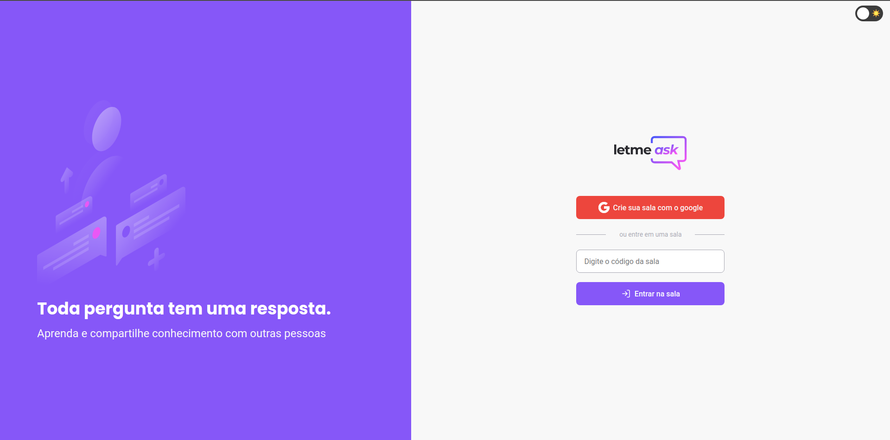
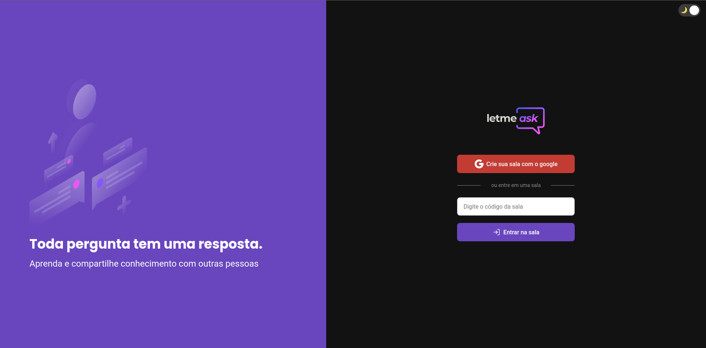

<header align="center">
    <h1>NLW Together - ReactJS</h1>
</header>

<main>
    

        
        <h2>Light Home - Desktop</h2>
        
          
        <h2>Dark Home - Desktop</h2>
        
    

      
    

        <h2>💻 Tecnologias</h2>
        <ul>
            <li><a href="https://firebase.google.com/">Firebase</a></li>
            <li><a href="https://pt-br.reactjs.org/">React</a></li>
            <li><a href="https://www.typescriptlang.org/">TypeScript</a></li>
        </ul>
    

      
    

        <h2>✏️ Projeto</h2>
        
Letmeask foi um app produzido durante a NLW Together, na trilha de ReactJS. O evento ocorreu dos dias 20 a 27 de Junho de 2021.

        
O Letmeask permite que qualquer pessoa crie salas de Q&A para gerenciar melhor as dúvidas que podem aparecer durante uma reunião, live ou evento.

    

      
    

        <h2>✨ Diferenciais</h2>
        
Para treinar meus aprendizados apliquei alguns elementos que não estavam no projeto original da Rocketseat:

        <ul>
            <li>Dark mode</li>
            <li>Protected Route - Criei esse componente React para que somente o autor/criador da sala possa acessar a página de administração</li>
        </ul>
    

      
    

        

        
Projetado pela <a href="https://www.rocketseat.com.br/">Rocketseat</a> 💜

        
Desenvolvido e adaptado por <a href="https://www.instagram.com/mateusvrs/">Mateus Vieira</a>

    

</main>